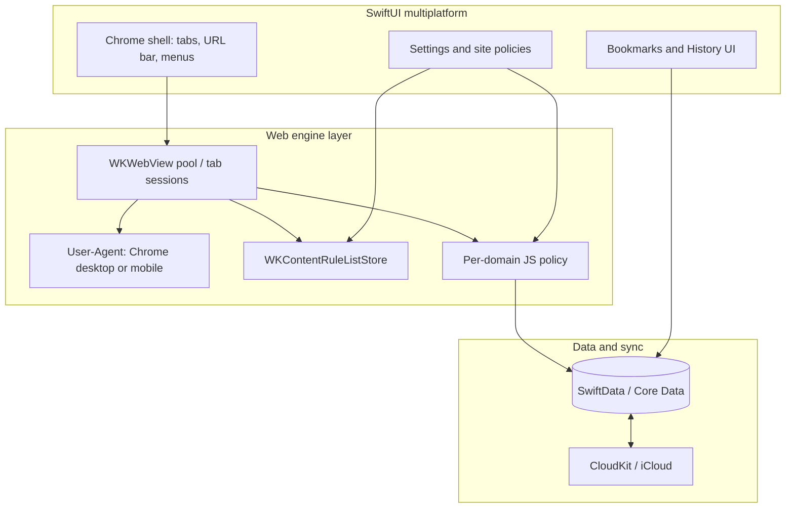
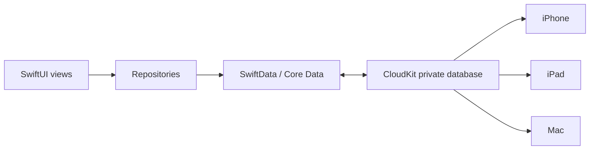

# Leap Browser — Architecture

## 1. Vision

Leap Browser is a focused, privacy-minded browser for Apple platforms: **one SwiftUI multiplatform app** that embeds **WKWebView**, blocks ads by default, lets users gate JavaScript per domain, spoofs a modern Chrome user-agent for compatibility, and syncs bookmarks and history via **iCloud**.

We deliberately stay inside Apple’s WebKit stack so iOS and macOS share almost all application code. Heavy engines (Chromium, Gecko) are reference material only.

## 2. High-level system

## 3. Project shape (Xcode)

Target layout (to be created in Milestone 1):

| Target | Role |
| --- | --- |
| `LeapBrowser` (multiplatform app) | Single app target with iOS + macOS destinations |
| `LeapBrowserShared` (optional SPM / local package) | Models, repositories, content-rule compilation, UA helpers — if the app target grows too large |
| Future: `LeapContentBlocker` (app extension) | Safari-style content blocker for system-wide rules *if* we want blocking outside the app; **not required for MVP** (in-app `WKContentRuleList` is enough) |

**UI paradigm:** SwiftUI throughout. Prefer `#if os(iOS)` / `#if os(macOS)` only for chrome affordances (toolbar placement, keyboard shortcuts, windowing). Navigation model, web session, and data layer stay shared.

**Minimum OS (proposal):** iOS 17+ / macOS 14+ so we can lean on modern SwiftUI and SwiftData without painful backports. Revisit if we need older devices.

## 4. Module breakdown

### 4.1 Browser chrome

- Tab strip / tab switcher (iPhone: sheet or grid; Mac: tab bar)
- URL / search field with speculative navigation
- Back / forward / reload / stop
- Share sheet (iOS) / share menu (macOS)
- Find-in-page (later milestone)

### 4.2 Web session (`WebSession` / `BrowserTab`)

Each tab owns:

- A `WKWebView` (or a recycled web view from a small pool)
- Navigation state (URL, title, loading, canGoBack/Forward)
- Observed events via `WKNavigationDelegate` / `WKUIDelegate`

Configuration is built from a shared `WebConfigurationFactory` that applies:

1. Chrome-compatible user-agent string (platform-appropriate: mobile vs desktop Chrome)
2. Content rule lists (ads / trackers)
3. JavaScript enabled flag derived from the **effective policy for the current host**
4. Standard privacy defaults (e.g. limit cross-site tracking where WK APIs allow)

**Per-domain JS:** When the user toggles JS for a domain, subsequent loads for that host recreate or update configuration. WKWebView does not always honour mid-session preference flips for already-loaded documents; architecture assumes **reload after policy change** (document this in UX).

### 4.3 Ad blocking

**MVP approach:** Ship curated JSON content-blocker rules compiled with `WKContentRuleListStore`.

- Bundle a baseline list (e.g. derived from EasyList-style rules converted to Apple’s content-blocker JSON subset, or a maintained third-party converter pipeline in repo tooling).
- Compile on first launch (and when the bundled list version changes); cache the compiled list identifier.
- Attach lists to every `WKWebViewConfiguration.userContentController`.

**Limitations to document honestly:**

- Apple’s content-blocker grammar is a *subset* of uBlock/Adblock syntax; some cosmetic filters will not apply.
- Blocking is best-effort; sites that ship first-party “ads” as first-party content will slip through.
- We study Brave’s shield UX and Firefox’s Enhanced Tracking Protection *product* patterns (defaults, exceptions per site), not their engines.

**Later:** optional Content Blocker app extension for Safari parity; remote list updates; per-site “allow ads” exception mirroring the JS exception model.

### 4.4 User-agent strategy

- Default: a current **Chrome** UA string, with separate mobile and desktop variants selected by platform (and optionally by request desktop site).
- Centralise strings in `UserAgentProvider` with a single update point when Chrome versions move.
- Do **not** claim to be Safari in the default path; Chrome UA is an explicit product requirement for compatibility.
- Keep an escape hatch in settings (“Browser identity”) for debugging.

### 4.5 Bookmarks

**Model (conceptual):**

- `Bookmark` — id, title, url, createdAt, updatedAt, optional folderId, sortIndex
- `BookmarkFolder` — id, title, parentId, sortIndex

Support nested folders, reorder, edit, open-in-tab. Deduplicate by normalised URL when syncing if desired (policy TBD in implementation).

### 4.6 History

**Model (conceptual):**

- `HistoryEntry` — id, url, title, visitedAt, visitCount (optional)

Features: chronological list, search, clear all / clear range, open from history. Cap local retention (e.g. 90 days) to keep sync payloads sane; make retention configurable later.

### 4.7 Site policies

**Model:**

- `SitePolicy` — host (eTLD+1 or full host — **decide in ADR**), javascriptEnabled (Bool?), adsAllowed (Bool?), notes

Resolution order:

1. Exact host override  
2. Registrable-domain override  
3. Global defaults (JS on, ads blocked)

Store locally and sync via the same CloudKit container as library data (or a dedicated preferences record type).

### 4.8 Persistence and iCloud sync

**Recommendation:** **SwiftData** with CloudKit sync if practical on the chosen OS versions; otherwise **Core Data + `NSPersistentCloudKitContainer`**, which has longer production track record for multi-device sync of structured browser data.

**Sync scope (MVP):** bookmarks, folders, history entries, site policies.  
**Not in MVP sync:** open tabs / session restore (nice follow-on; harder conflict story).

**Conflicts:** last-writer-wins on records with stable UUIDs; avoid merge-by-URL for bookmarks unless we add an explicit merge policy later. History append-only with UUID per visit reduces conflict pain.

**Capabilities:** enable iCloud + CloudKit in the developer portal; same iCloud container for iOS and macOS targets; user must be signed into iCloud.

**Privacy:** private CloudKit database only; no public DB; no analytics in MVP unless explicitly requested.

### 4.9 Security and privacy notes

- Prefer `https` upgrades where cheap (HTTPS-Only mode as a later toggle).
- Isolate website data per profile later; MVP is single profile.
- Clear website data action (cookies, cache) via `WKWebsiteDataStore`.
- Do not load remote rule lists over insecure channels without pinning / signing (if we add remote updates).
- Entitlements: iCloud, outgoing network; App Sandbox on Mac.

## 5. Platform UX differences (shared logic)

| Concern | iOS | macOS |
| --- | --- | --- |
| Tabs | Compact switcher | Native-feeling tab bar |
| Windows | Single scene / multiwindow later | Multi-window from day one if cheap |
| Keyboard | Software + shortcuts | Full shortcut set earlier |
| Settings | `Form` sheets | Settings scene / preferences window |

Web configuration, repositories, and sync stay identical.

## 6. What we borrow from open source (conceptually)

| Project | Useful patterns | What we do *not* take |
| --- | --- | --- |
| Brave | Shields defaults, per-site exceptions UX | Chromium stack, Rewards, BAT |
| Firefox / Focus | Tracking protection messaging, content-blocker packaging ideas | Gecko, full desktop chrome |
| WebKit / open WebKit browsers | WKWebView configuration pitfalls, process pool reuse | Forking WebKit |
| Safari content blockers | JSON rule list format and compile pipeline | Depending on Safari itself for in-app browsing |

Any copied *code* must respect licences (document in `NOTICE` / `ThirdParty` when we vendor converters or lists).

## 7. Testing strategy (lightweight)

- Unit tests: URL normalisation, policy resolution, UA provider, rule-list version gating
- UI tests: smoke navigate, bookmark round-trip (local), toggle JS and assert reload behaviour
- Sync: manual two-device checklist in milestones; automated CloudKit tests are expensive — keep manual until stable

## 8. Out of scope (for now)

- Extensions / Chrome Web Store compatibility  
- Tor / VPN  
- Multi-profile  
- Password manager / Wallet  
- Full Chromium embedding on either platform  
- Android / Windows  

## 9. Open questions (non-blocking for docs)

Captured for later product calls; defaults proposed in [DECISIONS.md](DECISIONS.md):

- Host key for policies: full host vs eTLD+1  
- Exact Chrome UA versioning cadence  
- Whether history syncs visit-by-visit or aggregated URLs  
- App display name / bundle IDs / iCloud container identifiers  
