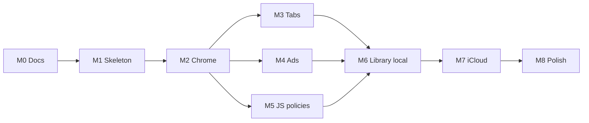

# Leap Browser — Milestones

Phased plan from empty repository → usable dual-platform browser → sync → polish. Each milestone has **exit criteria**. Prefer shipping a thin vertical slice early over polishing chrome before navigation works.

---

## Milestone 0 — Repository foundation *(this delivery)*

**Intent:** Capture product intent and technical direction so implementation does not thrash.

**Work**

- [x] `README.md` — overview and stack
- [x] `docs/ARCHITECTURE.md`
- [x] `docs/MILESTONES.md`
- [x] `docs/DECISIONS.md`

**Exit criteria**

- Docs merged (or committed) on the default branch
- Stakeholders agree SwiftUI + WKWebView + iCloud sync direction

---

## Milestone 1 — Xcode multiplatform skeleton

**Intent:** Openable project that builds for iOS Simulator and Mac.

**Work**

- Create SwiftUI multiplatform app target (`LeapBrowser`)
- Shared `ContentView` / app entry
- Placeholder `WKWebView` representable (`UIViewRepresentable` / `NSViewRepresentable` or `WebKit` SwiftUI wrappers as available)
- Basic load of a hardcoded HTTPS URL
- `.gitignore`, Xcode project committed (or `xcodegen` / Tuist if we prefer generated projects — default: commit `*.xcodeproj` for simplicity)
- Bundle identifiers + iCloud container placeholders documented

**Exit criteria**

- `⌘R` on iOS Simulator shows a web page
- Same scheme runs on Mac and shows a web page
- README updated with open/build steps

---

## Milestone 2 — Minimum viable chrome

**Intent:** Feel like a browser for a single tab.

**Work**

- URL bar (load on submit), back / forward / reload
- Page title + loading indicator
- Error state for failed navigations
- External link / `_blank` handling via `WKUIDelegate` (open in same tab for MVP)
- Chrome desktop vs mobile UA applied via `UserAgentProvider`

**Exit criteria**

- User can type a URL, navigate, go back/forward
- UA string matches the Chrome spoof decision (verify with a headers echo site)

---

## Milestone 3 — Tabs

**Intent:** Multi-tab browsing on both platforms.

**Work**

- Tab model (`BrowserTab`: id, session, title, URL)
- Create / close / switch tabs
- iOS tab switcher UI; macOS tab bar (or unified toolbar)
- Process pool sharing strategy documented and implemented

**Exit criteria**

- At least 3 concurrent tabs with independent history stacks
- Closing the last tab creates a fresh empty/new-tab state (define new-tab page: simple local start page is fine)

---

## Milestone 4 — Ad blocking (default on)

**Intent:** Ads blocked out of the box inside Leap.

**Work**

- Bundle v1 content-blocker JSON (start small and correct; expand coverage later)
- Compile + cache with `WKContentRuleListStore`
- Attach to all web configurations
- Settings toggle: blocking on/off (global)
- Per-site allow-ads exception (data model; UI can be minimal)

**Exit criteria**

- On a known ad-heavy test page, network/resource rules visibly reduce ad requests vs blocking off
- Toggle off restores unblocked behaviour after reload

---

## Milestone 5 — Per-domain JavaScript control

**Intent:** Satisfy the core policy requirement.

**Work**

- `SitePolicy` store (host key per ADR)
- Settings / site info UI: “JavaScript for this site”
- Apply via `WKPreferences.isJavaScriptEnabled` (or current API equivalent) on configuration; **reload** after change
- Global default: JS enabled

**Exit criteria**

- Disable JS on example.com → scripts do not run after reload
- Enable again → scripts run
- Policy persists across app launches (local)

---

## Milestone 6 — Bookmarks and history (local)

**Intent:** Library features without sync yet.

**Work**

- SwiftData/Core Data models for bookmarks, folders, history
- Add bookmark from current tab; edit / delete / folder organisation
- History list + search + clear
- Open bookmark/history item in current or new tab

**Exit criteria**

- CRUD bookmarks survives force-quit
- History records navigations (debounce / dedupe policy documented)
- Clear history empties the store

---

## Milestone 7 — iCloud sync

**Intent:** Bookmarks, history, and site policies sync across the user’s Apple devices.

**Work**

- Enable CloudKit capability + container for both destinations
- Mirror local store to CloudKit (SwiftData+CloudKit or `NSPersistentCloudKitContainer`)
- Conflict policy: UUID records, last-writer-wins
- Signed-out / iCloud-unavailable UX (work offline locally; sync when available)
- Manual test matrix: iPhone ↔ Mac

**Exit criteria**

- Bookmark created on Mac appears on iPhone (same iCloud account) within a reasonable window
- Site JS policy set on one device applies on the other after sync + navigation
- No crashes when iCloud is disabled (degrades to local-only)

---

## Milestone 8 — Polish and store readiness

**Intent:** Daily-driver quality and distribution prep.

**Work**

- Start page / empty state
- Find in page, share, copy link, desktop site request (Mac/iPad)
- Clear website data
- Keyboard shortcuts (Mac-first)
- Accessibility pass (Dynamic Type, VoiceOver labels on chrome)
- Privacy policy / App Store screenshots / metadata
- Expand blocklist coverage; licence `NOTICE` for third-party lists
- Crash/performance pass (web process termination recovery)

**Exit criteria**

- Internal TestFlight (iOS) + notarised or direct Mac build as appropriate
- Checklist of known limitations published in README

---

## Suggested sequencing

M4 and M5 can proceed in parallel after M2. M3 can overlap with them if needed. **Do not start M7 until M6 is stable locally.**

---

## Non-goals through Milestone 8

- Android / Windows  
- Extension ecosystem  
- Chromium embedding  
- Full session sync (open tabs)  
- Built-in password manager  

---

## Next action after docs land

Implement **Milestone 1** (Xcode multiplatform skeleton) in this repository once write access / Cursor cloud agent access to `cpascoli/leap-browser` is available.
